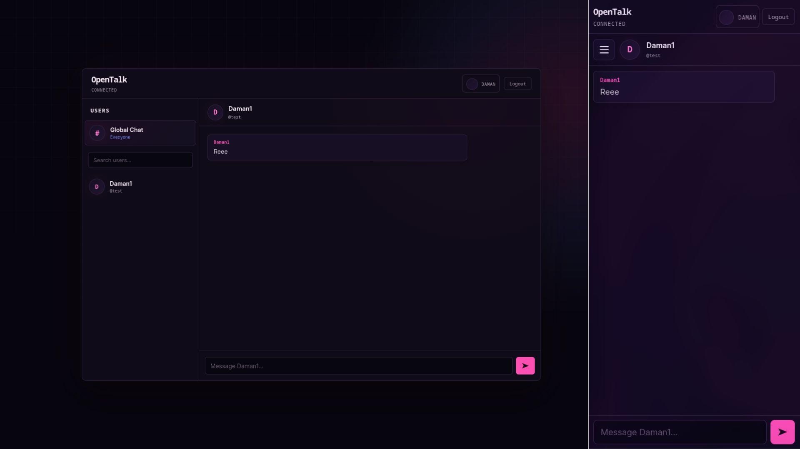
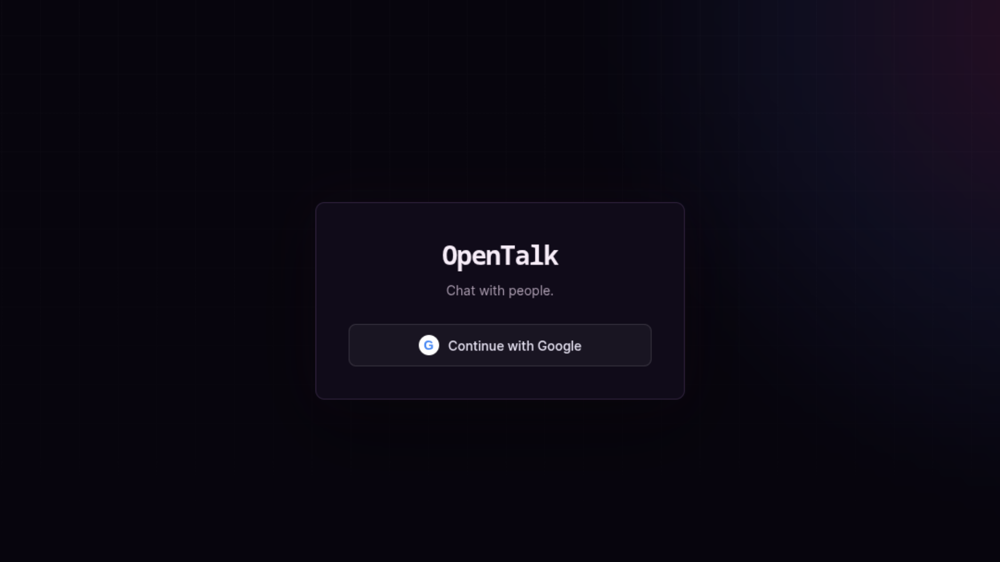
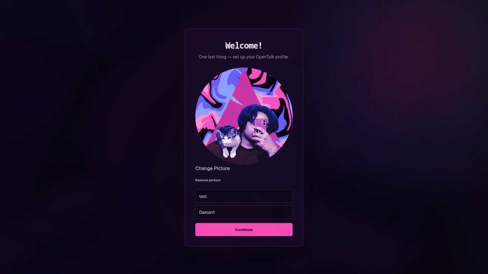

# OpenTalk

A simple real-time chat application built with vanilla JavaScript and Supabase.

<p align="center">
  
</p>

### Login

<p align="center">
  
</p>

### Profile Setup

<p align="center">
  
</p>

### Chat

<p align="center">
  
</p>

## Setup

### 1. Clone the repository

```bash
git clone https://github.com/damanchakraborty/OpenTalk.git
cd OpenTalk
```

### 2. Create a Supabase project

Create a new project in Supabase and get your project URL and publishable key.

Add them to `app.js`:

```js
const SUPABASE_URL = "your-project-url";
const SUPABASE_KEY = "your-publishable-key";
```

Do not use a Supabase service-role key in frontend code.

### 3. Configure Google Authentication

In the Supabase dashboard, go to:

`Authentication → Providers → Google`

Enable Google and add your OAuth credentials.

Configure the redirect URL to point to:

```text
auth-callback.html
```
## Note: Make a Google OAuth Client at https://console.cloud.google.com/ and add your Javascript origins (Github Pages URL) and Redirect URLs (Supabase Callback URL)


### 4. Create the database

Open:

`Supabase Dashboard → SQL Editor`

Paste and run the following SQL:

<details>
<summary><strong>Database SQL</strong></summary>

```sql
create extension if not exists "pgcrypto";

create table if not exists public.profiles (
    id uuid primary key
        references auth.users(id)
        on delete cascade,

    username text not null,
    display_name text not null,
    avatar_url text,

    created_at timestamptz not null default now(),
    updated_at timestamptz not null default now()
);

alter table public.profiles
    drop constraint if exists profiles_username_length;

alter table public.profiles
    add constraint profiles_username_length
    check (char_length(username) between 3 and 24);

alter table public.profiles
    drop constraint if exists profiles_username_format;

alter table public.profiles
    add constraint profiles_username_format
    check (username ~ '^[a-z0-9_]{3,24}$');

alter table public.profiles
    drop constraint if exists profiles_display_name_length;

alter table public.profiles
    add constraint profiles_display_name_length
    check (char_length(display_name) between 1 and 40);

create unique index if not exists profiles_username_lower_unique
on public.profiles (lower(username));

create or replace function public.set_updated_at()
returns trigger
language plpgsql
as $$
begin
    new.updated_at = now();
    return new;
end;
$$;

drop trigger if exists profiles_set_updated_at
on public.profiles;

create trigger profiles_set_updated_at
before update on public.profiles
for each row
execute function public.set_updated_at();

alter table public.profiles enable row level security;

drop policy if exists "Authenticated users can view profiles"
on public.profiles;

create policy "Authenticated users can view profiles"
on public.profiles
for select
to authenticated
using (true);

drop policy if exists "Users can create their own profile"
on public.profiles;

create policy "Users can create their own profile"
on public.profiles
for insert
to authenticated
with check (id = auth.uid());

drop policy if exists "Users can update their own profile"
on public.profiles;

create policy "Users can update their own profile"
on public.profiles
for update
to authenticated
using (id = auth.uid())
with check (id = auth.uid());


create table if not exists public.conversations (
    id uuid primary key default gen_random_uuid(),

    user_one_id uuid not null
        references auth.users(id)
        on delete cascade,

    user_two_id uuid not null
        references auth.users(id)
        on delete cascade,

    created_at timestamptz not null default now(),

    constraint conversations_different_users
        check (user_one_id <> user_two_id),

    constraint conversations_ordered_users
        check (user_one_id < user_two_id),

    constraint conversations_unique_users
        unique (user_one_id, user_two_id)
);

create index if not exists conversations_user_one_idx
on public.conversations (user_one_id);

create index if not exists conversations_user_two_idx
on public.conversations (user_two_id);

alter table public.conversations enable row level security;

drop policy if exists "Users can view their conversations"
on public.conversations;

create policy "Users can view their conversations"
on public.conversations
for select
to authenticated
using (
    user_one_id = auth.uid()
    or user_two_id = auth.uid()
);


create or replace function public.get_or_create_conversation(
    target_user_id uuid
)
returns uuid
language plpgsql
security definer
set search_path = public
as $$
declare
    conversation_uuid uuid;
    first_user uuid;
    second_user uuid;
begin
    if auth.uid() is null then
        raise exception 'Not authenticated';
    end if;

    if target_user_id = auth.uid() then
        raise exception 'Cannot create a conversation with yourself';
    end if;

    if auth.uid() < target_user_id then
        first_user := auth.uid();
        second_user := target_user_id;
    else
        first_user := target_user_id;
        second_user := auth.uid();
    end if;

    select id
    into conversation_uuid
    from public.conversations
    where user_one_id = first_user
      and user_two_id = second_user
    limit 1;

    if conversation_uuid is not null then
        return conversation_uuid;
    end if;

    insert into public.conversations (
        user_one_id,
        user_two_id
    )
    values (
        first_user,
        second_user
    )
    on conflict (user_one_id, user_two_id)
    do nothing
    returning id
    into conversation_uuid;

    if conversation_uuid is null then
        select id
        into conversation_uuid
        from public.conversations
        where user_one_id = first_user
          and user_two_id = second_user
        limit 1;
    end if;

    return conversation_uuid;
end;
$$;


create table if not exists public.messages (
    id uuid primary key default gen_random_uuid(),

    conversation_id uuid not null
        references public.conversations(id)
        on delete cascade,

    user_id uuid not null
        references auth.users(id)
        on delete cascade,

    content text not null,

    created_at timestamptz not null default now(),

    constraint messages_content_length
        check (char_length(content) between 1 and 500)
);

create index if not exists messages_conversation_created_idx
on public.messages (conversation_id, created_at);

alter table public.messages enable row level security;

create or replace function public.is_conversation_member(
    conversation_uuid uuid
)
returns boolean
language sql
stable
security definer
set search_path = public
as $$
    select exists (
        select 1
        from public.conversations c
        where c.id = conversation_uuid
        and (
            c.user_one_id = auth.uid()
            or c.user_two_id = auth.uid()
        )
    );
$$;

drop policy if exists "Conversation members can read messages"
on public.messages;

create policy "Conversation members can read messages"
on public.messages
for select
to authenticated
using (
    public.is_conversation_member(conversation_id)
);

drop policy if exists "Conversation members can send messages"
on public.messages;

create policy "Conversation members can send messages"
on public.messages
for insert
to authenticated
with check (
    user_id = auth.uid()
    and public.is_conversation_member(conversation_id)
);


do $$
begin
    alter publication supabase_realtime
        add table public.messages;
exception
    when duplicate_object then
        null;
end;
$$;


insert into storage.buckets (
    id,
    name,
    public,
    file_size_limit,
    allowed_mime_types
)
values (
    'avatars',
    'avatars',
    false,
    5242880,
    array[
        'image/png',
        'image/jpeg',
        'image/webp'
    ]
)
on conflict (id)
do update set
    public = excluded.public,
    file_size_limit = excluded.file_size_limit,
    allowed_mime_types = excluded.allowed_mime_types;


drop policy if exists "Users can upload their own avatars"
on storage.objects;

create policy "Users can upload their own avatars"
on storage.objects
for insert
to authenticated
with check (
    bucket_id = 'avatars'
    and (storage.foldername(name))[1] = auth.uid()::text
);

drop policy if exists "Authenticated users can read avatars"
on storage.objects;

create policy "Authenticated users can read avatars"
on storage.objects
for select
to authenticated
using (
    bucket_id = 'avatars'
);

drop policy if exists "Users can update their own avatars"
on storage.objects;

create policy "Users can update their own avatars"
on storage.objects
for update
to authenticated
using (
    bucket_id = 'avatars'
    and (storage.foldername(name))[1] = auth.uid()::text
)
with check (
    bucket_id = 'avatars'
    and (storage.foldername(name))[1] = auth.uid()::text
);

drop policy if exists "Users can delete their own avatars"
on storage.objects;

create policy "Users can delete their own avatars"
on storage.objects
for delete
to authenticated
using (
    bucket_id = 'avatars'
    and (storage.foldername(name))[1] = auth.uid()::text
);
```

</details>

## Database

OpenTalk uses three main tables.

### `profiles`

Stores information about each user's profile.

| Column         | Description               |
| -------------- | ------------------------- |
| `id`           | Supabase auth user ID     |
| `username`     | Unique username           |
| `display_name` | Name shown to other users |
| `avatar_url`   | Google or uploaded avatar |
| `created_at`   | Profile creation time     |
| `updated_at`   | Last profile update       |

### `conversations`

Stores private conversations between two users.

| Column        | Description     |
| ------------- | --------------- |
| `id`          | Conversation ID |
| `user_one_id` | First user      |
| `user_two_id` | Second user     |
| `created_at`  | Creation time   |

The two user IDs are stored in a consistent order, preventing the same two users from accidentally getting multiple conversations.

### `messages`

Stores messages belonging to conversations.

| Column            | Description                         |
| ----------------- | ----------------------------------- |
| `id`              | Message ID                          |
| `conversation_id` | Conversation the message belongs to |
| `user_id`         | Sender                              |
| `content`         | Message text                        |
| `created_at`      | Message creation time               |

Messages are limited to 500 characters.

## Profile Pictures

OpenTalk supports both Google profile pictures and uploaded images.

Uploaded images are stored in Supabase Storage using:

```text
avatars/
└── <user-id>/
    └── <random-file-name>
```

The `avatar_url` column stores either the Google image URL or the Supabase Storage path.

The frontend resolves Storage paths into usable image URLs when displaying avatars.

## Realtime

Messages use Supabase Realtime.

When a message is inserted into the `messages` table, connected clients listening to that conversation receive the new message without refreshing the page.
